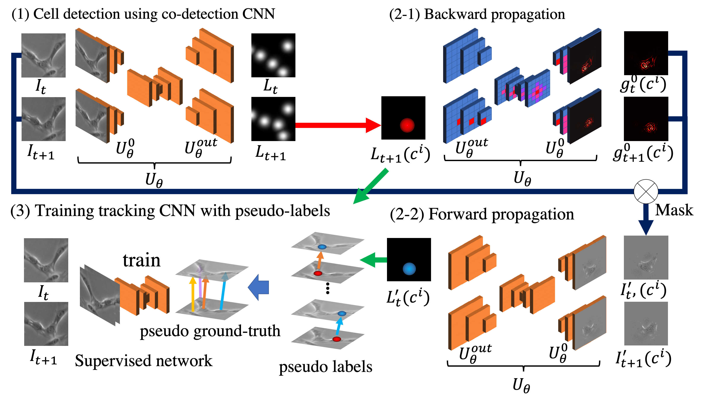

<h2 align="center">Weakly-Supervised Cell Tracking via Backward-and-Forward Propagation</h2>

by Kazuya Nishimura, Junya Hayashida, Chenyang Wang, Dai Fei Elmer Ker, Ryoma Bise

[[Home]]() [[Project]]() [[Paper]](https://arxiv.org/abs/2007.15258)



## Prerequisites
- [python >= 3.6](https://www.python.org)
- [ubuntu 18.04](https://ubuntu.com/)
- CPU or GPU(NVIDIA Driver >= 430)
- [matlab](https://jp.mathworks.com/products/matlab.html)

## Installation

Python setting
### Conda user
```bash
conda env create -f=requirement.yml
conda activate pytorch
```

### Docker user
```bash
docker build ./docker
sh run_docker.sh
```

## Background estimation
```bash
matlab -nodesktop -nosplash -r 'Background_estimation.m
```

## Cell detection 
```bash
python predict.py
```

## Backward Propagation
```bash
python backward_propagation.py
```

## Forward Propagation
```bash
python forward_propagation.py
```

## Association
```bash
python association_with_forward_propagation.py
```

